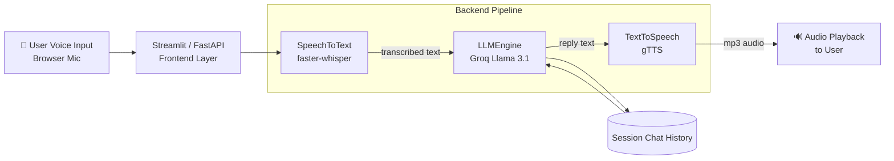

# 🎙️ Voice AI Assistant

A production-structured voice assistant: record your voice → **Whisper** transcribes it →
**Llama 3.1 (via Groq)** generates a reply → **gTTS** speaks the reply back to you.
Ships as both a **Streamlit** app and a **FastAPI** REST service, fully **Dockerized**.

---

## ✨ Features

- 🎤 One-click browser mic recording (no external mic app needed)
- 📝 Fast, accurate speech-to-text with `faster-whisper` (CPU-friendly, int8 quantized)
- 🧠 Low-latency LLM replies via Groq's Llama 3.1 API
- 🔊 Natural-sounding text-to-speech via gTTS
- 💬 Multi-turn conversation memory (session-based)
- 🌐 Dual interface: Streamlit UI **and** FastAPI REST endpoints
- 🐳 Docker + docker-compose for one-command deployment
- ✅ Unit tests for the core pipeline

---

## 🏗️ Architecture



**Flow:**
1. User records audio in the browser (Streamlit) or uploads a file (FastAPI).
2. `src/stt.py` transcribes it to text using `faster-whisper`.
3. `src/llm.py` sends the text + chat history to Groq's Llama 3.1 model.
4. `src/tts.py` converts the LLM's reply into speech with gTTS.
5. The audio is streamed back and played to the user; the turn is stored in chat history.

---

## 📁 Project Structure

```
voice-ai-assistant/
├── app.py                  # Streamlit UI (main entry point)
├── api.py                  # FastAPI REST backend (alternative entry point)
├── src/
│   ├── __init__.py
│   ├── config.py           # Env-driven configuration
│   ├── stt.py               # Speech-to-Text (faster-whisper)
│   ├── llm.py                # LLM engine (Groq Llama 3.1)
│   ├── tts.py                 # Text-to-Speech (gTTS)
│   └── utils.py               # Shared helpers (save/cleanup audio files)
├── tests/
│   └── test_pipeline.py    # Unit tests
├── screenshots/             # App screenshots (see note below)
├── requirements.txt
├── Dockerfile
├── docker-compose.yml
├── .env.example
└── README.md
```

---

## 📊 Dataset

This project uses **pretrained models** (Whisper for STT, Llama 3.1 for language,
gTTS for speech synthesis) — there is no custom training step, so no proprietary
dataset is required.

For **testing your STT pipeline** with real sample voice clips, use the free,
open **Mozilla Common Voice** dataset:
🔗 https://commonvoice.mozilla.org/en/datasets

You can download a handful of `.mp3`/`.wav` clips from there and run them through
`SpeechToText().transcribe("sample.wav")` to sanity-check accuracy before recording
your own demo.

---

## ⚙️ Setup

### 1. Clone and enter the project
```bash
git clone https://github.com/Punithrajkumar602-boop/voice-ai-assistant.git
cd voice-ai-assistant
```

### 2. Create a virtual environment (Python 3.11 recommended)
```bash
py -3.11 -m venv venv
venv\Scripts\activate          # Windows PowerShell
# source venv/bin/activate     # macOS/Linux
```

### 3. Install dependencies
```bash
pip install -r requirements.txt
```
> Note: `faster-whisper` and `gTTS` need `ffmpeg` installed on your system.
> Windows: `choco install ffmpeg` (or download from ffmpeg.org and add to PATH).

### 4. Configure environment variables
```bash
copy .env.example .env         # Windows
# cp .env.example .env          # macOS/Linux
```
Then edit `.env` and add your free Groq API key from https://console.groq.com/keys

### 5. Run the Streamlit app
```bash
py -m streamlit run app.py
```
Open http://localhost:8501, click the mic button, and talk.

### 6. (Optional) Run the FastAPI backend instead
```bash
uvicorn api:app --reload --port 8000
```
Interactive API docs: http://localhost:8000/docs

---

## 🐳 Docker Deployment

### Build and run the Streamlit UI only
```bash
docker build -t voice-ai-assistant .
docker run -p 8501:8501 --env-file .env voice-ai-assistant
```

### Run both Streamlit UI + FastAPI backend together
```bash
docker-compose up --build
```
- Streamlit UI → http://localhost:8501
- FastAPI docs → http://localhost:8000/docs

---

## 🧪 Running Tests
```bash
pytest tests/ -v
```

---

## 🔌 API Reference (FastAPI)

| Method | Endpoint          | Description                                   |
|--------|--------------------|-----------------------------------------------|
| GET    | `/health`          | Health check                                  |
| POST   | `/transcribe`      | Upload audio → get transcription              |
| POST   | `/chat`            | Send text + history → get LLM reply           |
| POST   | `/speak`           | Send text → get back mp3 speech               |
| POST   | `/voice-chat`      | Upload audio → full pipeline (STT+LLM+TTS)    |
| GET    | `/download-audio/{filename}` | Fetch a generated mp3 reply         |

Example:
```bash
curl -X POST http://localhost:8000/chat \
  -H "Content-Type: application/json" \
  -d '{"text": "What can you help me with?", "chat_history": []}'
```

---

## 📸 Screenshots

Add screenshots here after running the app locally:
1. Run `py -m streamlit run app.py`
2. Record yourself clicking the mic button, speaking, and seeing the reply + transcript.
3. Save screenshots into `screenshots/` as `01_recording.png`, `02_transcript_reply.png`,
   `03_conversation_history.png`, and embed them below:

```markdown


```

---

## 🎬 Demo Video (1–2 minutes)

Suggested script when recording your demo (e.g. with OBS Studio or Windows Game Bar `Win+G`):
1. **(0:00–0:15)** Show the README/architecture diagram, state the tech stack out loud.
2. **(0:15–0:45)** Open the Streamlit app, click record, ask: *"What's the capital of India, and give me one fun fact about it?"*
3. **(0:45–1:15)** Show the transcription appearing, the LLM reply text, and play the spoken audio reply.
4. **(1:15–1:45)** Ask a follow-up question to show conversation memory is working.
5. **(1:45–2:00)** Briefly show the FastAPI `/docs` page and/or the Docker container running.

Save as `demo_video.mp4` in the repo root or upload to YouTube/Loom and link it here:
```markdown
🎥 [Watch the demo video](your-video-link-here)
```

---

## 🛠️ Tech Stack

| Layer          | Technology                          |
|----------------|--------------------------------------|
| Speech-to-Text | faster-whisper (OpenAI Whisper)      |
| Language Model | Llama 3.1 via Groq API               |
| Text-to-Speech | gTTS                                  |
| Frontend       | Streamlit + `audio-recorder-streamlit` |
| Backend API    | FastAPI + Uvicorn                    |
| Containerization | Docker + docker-compose             |
| Testing        | pytest                                |

---

## 📄 License

MIT — free to use and adapt for your own portfolio.
